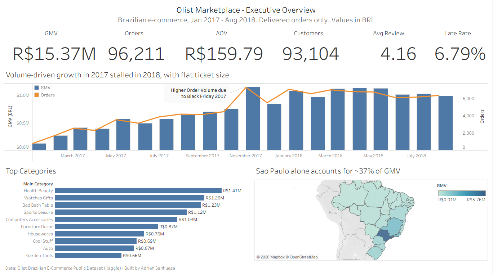

# Olist Marketplace Analysis — Revenue, Payments & Customer Experience

**Interactive dashboard:** [View on Tableau Public](https://public.tableau.com/app/profile/adrian.sanhueza6821/viz/OlistMarketplace-ExecutiveOverview/ExecutiveOverview)

> **Business question:** What drives revenue and customer satisfaction in a marketplace?

An end-to-end analytics project on ~96,000 real (anonymized) orders from Olist, a Brazilian e-commerce marketplace: data preparation in Python, a three-page executive dashboard in Tableau, and business recommendations.



---

## Key Findings

**1. Growth is volume-driven and stalled in 2018.**
Order volume grew strongly through 2017 but plateaued in 2018, while average order value stayed flat (~R$160). With ~1.03 orders per customer, the business grows almost entirely by acquiring new customers rather than retaining existing ones.

**2. Installment financing is central to high-value orders.**
Credit cards cover ~78% of payment value, and 67.9% of credit-card orders are paid in installments. Installment use rises sharply with ticket size: from under 2 installments on average for orders below R$50 to nearly 8 for orders above R$1,000.

**3. Late deliveries strongly reduce customer satisfaction.**
On-time orders average a 4.29 review score; orders delivered 15+ days late average 1.71. Although only 6.8% of orders arrive late, delays are concentrated in Northeastern states (Maranhão: ~18%, vs. a 6.8% national average) and in the post–Black Friday 2017 period, when actual delivery times rose and eroded the gap with promised delivery times (12.5 actual vs. 23.6 promised days on average).

## Recommendations

- **Raise ticket size through financing terms:** A/B test interest-free installment thresholds, since installments are concentrated in high-value orders.
- **Protect satisfaction during demand peaks:** Plan logistics capacity ahead of Black Friday, when delivery times deteriorated.
- **Prioritize logistics improvements by impact:** Target high-volume states with above-average late rates (e.g., Rio de Janeiro at ~12%) alongside the Northeast.
- **Investigate retention:** Late deliveries may contribute to the very low repeat-purchase rate — a hypothesis worth testing with cohort analysis.

*Note: these findings are correlational. For example, the data shows that late orders receive much worse reviews, not that delays are the only cause of low satisfaction.*

---

## Dashboard Pages

| Page | Focus |
|---|---|
| Executive Overview | GMV, orders, AOV, customers, monthly trend, top categories, GMV by state |
| Payments | Payment mix, installment behavior by ticket size, mix over time |
| Operations & Customer Experience | Delivery performance, reviews by delivery status, late rate by state |

## Data

[Brazilian E-Commerce Public Dataset by Olist](https://www.kaggle.com/datasets/olistbr/brazilian-ecommerce) (Kaggle) — 9 relational tables covering orders, items, payments, reviews, customers, sellers and products.

The raw data is not included in this repository. Download it from Kaggle and place the CSV files in a `data/` folder.

## Data Preparation

`olist_data_prep.py` loads the 9 tables, cleans and joins them, and produces three analysis-ready tables for Tableau:

| Output | Grain | Used for |
|---|---|---|
| `fact_orders.csv` | One row per order | Overview and Operations pages |
| `fact_order_items.csv` | One row per order item | Category and seller analysis |
| `fact_payments.csv` | One row per payment | Payments page |

### Key decisions

- **Scope:** Delivered orders only, from Jan 2017 to Aug 2018. Earlier and later months have very few orders and distort trends.
- **No double counting:** Items and payments are aggregated to order level *before* joining, since an order can have several items and several payments.
- **Unique customers:** Counted with `customer_unique_id`, because `customer_id` changes with every order.
- **Revenue definition:** GMV = product price + freight. Payments were reconciled against GMV: only 0.3% of orders differ by more than R$1, and totals differ by ~0.02% (likely installment interest).
- **Reviews:** Orders with multiple reviews are averaged to keep one row per order.
- **Late delivery:** An order is late if delivered on a calendar day after the promised date. Orders without a delivery date (8) are excluded from delivery metrics.
- **Installment metrics:** Calculated on credit-card orders only, since boleto and debit payments are always a single installment.

### Data quality summary

| Check | Result |
|---|---|
| Orders in scope | 96,211 |
| Unique customers | 93,104 |
| Orders without items / payments | 0 / 0 |
| Orders without delivery date | 8 |
| Orders without review | 643 |
| Payments ≠ GMV (> R$1) | 241 (0.3%) |

### Known limitations

- **Survivorship bias in recent months:** Because only delivered orders are included, the last months under-represent slow deliveries (orders still in transit when the data was extracted), making recent delivery times look faster.
- **Category attribution:** Order-level category charts assign the full order value to the order's main category. Exact category revenue is available in `fact_order_items.csv`.

## How to Run

```bash
pip install -r requirements.txt
python olist_data_prep.py
```

Expected structure:

```
project/
├── olist_data_prep.py
├── data/      ← Olist CSV files from Kaggle
└── output/    ← created by the script
```

The script locates the `data/` folder automatically and works from the terminal, Spyder or Jupyter. Tested on Python 3.8+.

## Tools

Python (pandas, NumPy) · Tableau Public

---

**Author:** Adrián Sanhueza — Financial & BI Analyst
